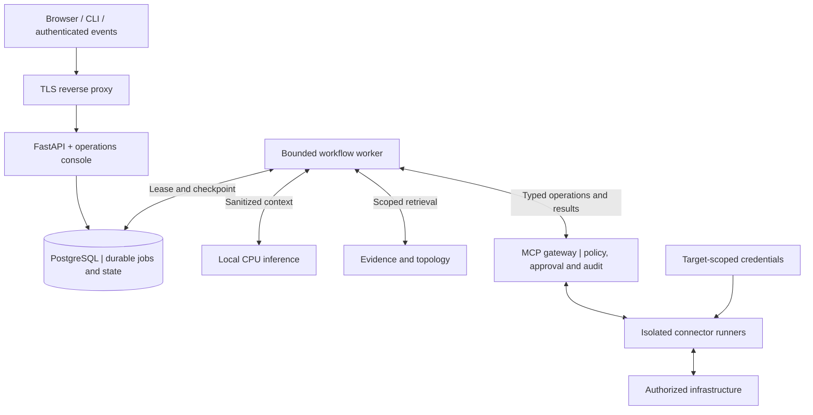

# NextOps

### CPU-only AI for evidence-grounded IT operations

[فارسی](README_FA.md) · [Release status](docs/status/current-release.yaml) · [Status brief](docs/en/PROJECT_STATUS_BRIEF.md) · [Documentation](docs/en/INDEX.md) · [G10 server plan](docs/en/SERVER_PLAN.md) · [Diagrams](docs/en/DIAGRAMS.md) · [Tech stack](docs/en/TECH_STACK.md) · [Architecture](docs/en/ARCHITECTURE.md) · [Roadmap](docs/en/ROADMAP.md) · [Project state](docs/PROJECT_STATE.md)

Owner update (2026-09-26): the owner tested an ESXi VM snapshot restore. Its dated result has
not been reviewed here; independent database backup and restore gates remain unpassed.

Current controlled UI/source follow-up (2026-10-07): app/API **`ec1ed32`** expose actual Qwen3.8
metadata, visible approved Zabbix source/host selection and problem/metric filters. The existing
secondary MCP source passed fresh reads on three approved targets, saved-chat resume, audit/hash
matching and exact source rollback/reapply. Eight fresh finals passed bounded functionality;
unsupported model reachability wording/severity labels remain unaccepted, not live facts.
Native Q8/configuration/MCP are unchanged; thinking stays off. See the
[dated UI/source record](docs/requirements/UI_QWEN38_SOURCE_QUALIFICATION_2026-10-07.md) and
[usage](docs/en/UI.md). This is controlled live functionality, not full production acceptance.

Initial controlled selection (2026-10-07): **Qwen3.8-27B Q8** went live under the owner's explicit
three-case raw-quality exception. App `3d92b71` stays unchanged; AI `60605d8` uses CPU-only32 workers,
16K admission,300/330/360-second budgets and thinking off. Fourteen fresh browser finals, saved-chat
resume, secondary Zabbix EN/FA evidence, audit/hash matching and exact rollback/reapply passed.
Raw13/16 remains failed; larger-context/thinking/current server-WAN/VM/load are not accepted.
See [the dated record](docs/requirements/QWEN38_CONTROLLED_CUTOVER_2026-10-07.md). Controlled live
use is not full production acceptance; verify answers against their qualified evidence.

Earlier controlled repair (2026-10-04): app/AI API `7ce9d29` adds bounded hypothetical-scenario
and transport/stale-data safeguards while preserving fresh evidence, saved chat and OCS branding.
Five CI jobs, 524 local checks, three offline installs, 45 functional browser cases, 36 text-free
audits/nine live hashes, bounded queue recovery, four-guest WAN/proxy denial, process restart,
exact69 rollback and final re-promotion passed. Limits are visibly application-owned, not model
training or unrestricted factual accuracy. Thinking stays off; full-context/VM cold-start and
general semantic acceptance remain open. See [the record](docs/en/TESTING.md) and authoritative
[release status](docs/status/current-release.yaml). Live controlled use is not full production acceptance.

Earlier controlled repair (2026-10-03): app/AI API `69c9260` fixes the reported AI-server question
by visibly selecting the existing approved target, returning that server's actual Linux state
and keeping Zabbix scope separate. Five CI jobs, offline installs, seven final live functional
cases, audit/hash matching, exact b5e74f9 rollback and bounded queue recovery passed. Branding,
standard saved chat and the CPU-only 35B runtime/profile are unchanged. Thinking remains off;
Persian brevity/format and broader semantics are still partial. Near-full-context thinking
generation failed at 120 seconds; this source's WAN/VM tests remain unrun and older records dated. Controlled use is
live, not full production acceptance. [Release status](docs/status/current-release.yaml) is authoritative.

Thinking qualification (2026-10-03): source-only final-envelope/format hardening and a private
opt-in real-token test runner are implemented. Four revised exact-format cases passed, but technical
semantics and the near-16K deadline remain failed; thinking is not enabled. Fresh standard browser
recovery and audit passed. [Measured results](docs/en/TESTING.md) distinguish staged source from live service.

Earlier controlled workspace (2026-09-30): app/AI API b5e74f9 serves the unchanged CPU-only 35B
model with owner-scoped saved chat, bounded follow-ups and a header light/dark switch. OCS logo/base
palette and focused read-only evidence remain intact. Configured context is 16K; thinking failed
and stays disabled. Five CI jobs, exact offline installs, 15 functional live cases, matched
app/AI/proxy rollback, audit/hash checks, four-guest WAN denial and real serial VM reboots passed.
Fresh login, answers and Zabbix evidence worked after boot with WAN denied. Full-context quality,
technical semantics/brevity, contention and independent recovery remain unqualified. Controlled
use is live, **not full production acceptance**. [Release status](docs/status/current-release.yaml)
is authoritative; older summaries below are historical.

Earlier answer-quality checkpoint (2026-09-29): the guarded clarity repair passed twelve fresh authenticated
English/Persian API cases, including the four file-focus and host-scope failures observed on
2026-09-26. This is a bounded regression pass, not a complete held-out semantic qualification.
The 14B CPU model was imported and rejected after matched bilingual factual/arithmetic and
evidence-qualifier findings. The verified 32B import completed eleven answers, but a Persian
stale-evidence question exceeded the 120-second timeout. It was not selected. Official pinned
30B-A3B import and fourteen matched completions passed, at 1.3–23.7 seconds; raw evidence
qualifiers and Persian wording failed later review. Its corrected timed app trial fixed answer
direction but rejected selection for Persian technical errors and repeat length-limited raw
investigation. The baseline 8B also hit that raw Persian filesystem limit; the complete focused
application answer and raw model completion are separate. Exact model/source rollback passed.
At that checkpoint, only the RTL source repair was live as 8d1f1d2/8B; 35B was being provisioned.
The current controlled 35B selection is recorded below; earlier failures remain preserved.

> **Earlier 35B qualification, retained history—not the serving identity.** App/AI API were `nextops-0.1.0-95c6e50`; connector remains `nextops-0.1.0-cdde129`. The selected CPU-only model is Qwen3.5-35B-A3B Q4_K_M. Twelve API and twelve strict browser cases, eight read-only audit/hash pairs, exact 8B/app/API rollback and six final re-promotion checks passed. Sample API latency was 12.7–94.3 seconds; VM/runtime/resource/queue/deadline limits did not change. Source/time/partial/stale evidence and transparent deterministic CPU/file focus remain mandatory; model-only text can still be wrong. Full held-out quality is partial, and current-release server-WAN/VM cold-start gates are not run. Consult [release status](docs/status/current-release.yaml), [testing](docs/en/TESTING.md) and [project state](docs/PROJECT_STATE.md). Recovery stays owner-deferred and unqualified; certificate, notification, licensing, release-integrity and final production gates remain open. The retired owner form does not block development. Restricted services do not imply permanent management-shell WAN denial. See the [production runbook](docs/en/PRODUCTION_BLOCKERS_RUNBOOK.md).

## What NextOps is intended to do

NextOps is a proposed bilingual IT operations platform for investigating infrastructure incidents, correlating monitoring evidence, and recommending safe next steps. A later, separately approved phase introduces tightly controlled remediation. Persian and English are first-class product and documentation languages.

Phase 1 delivered **a new Persian/English question → authorized read-only Zabbix data → a locally generated, evidence-linked status answer → an audit record, with Internet blocked**. Phase 2 now enriches that path with bounded direct Linux diagnostics for four approved targets. Eleven integration families remain in the roadmap; none is advertised as working before its tests and capability record exist.

## Deployment constraints

| Requirement | Project baseline |
|---|---|
| Repository | GitHub monorepo |
| Initial host | One existing G10 running ESXi 8.0.3 build 24414501 according to owner-supplied output; current free CPU/RAM and contention remain unverified |
| Reported resources | 4 CPU packages, 112 physical cores, 224 logical threads, 4 NUMA nodes; 1,442,743,631,872 bytes RAM (1,343.66 GiB); supplied VMFS figures are point-in-time capacity, not storage-health evidence |
| AI execution | Local CPUs only; no GPU, external inference, or cloud fallback |
| Offline operation | No Internet dependency after provisioning, including fresh login and cold start; authorized management-LAN access remains necessary for live evidence |
| Languages | Native Persian with RTL support; English with LTR support |
| Safety | Read-only first; deterministic authorization; exact-action approval for later mutations |

The owner's ESXi output replaces the earlier approximately 90 CPU / 1 TB estimate; see the [sanitized evidence record](docs/requirements/HARDWARE_BASELINE.json). These are reported host totals, not a direct inspection or available-capacity measurement. The average is 28 cores per NUMA node, but actual per-node CPU/memory distribution is not yet verified. Preserve ESXi; Ubuntu is the proposed guest OS, and application containers/systemd services belong inside the VMs.

**Proposed VM plan:** three NextOps VMs for Phase 1–2, plus the dedicated Zabbix prerequisite when no suitable authorized instance exists; later profiles add database separation and controlled remediation. Do not duplicate an existing suitable Zabbix. The initial four-VM proposal is **40 vCPU, 184 GiB RAM, and 980 GiB disk**, including a **24-vCPU / 128-GiB AI VM** for a topology-aware benchmark baseline. This is not a measured minimum, confirmed single-node placement or capacity guarantee. See the [per-phase allocations and Zabbix acceptance gates](docs/en/SERVER_PLAN.md) and the [mandatory offline contract](docs/en/OFFLINE_RUNTIME.md).

## Proposed architecture



**The model proposes. Application policy authorizes. The execution boundary holds device credentials.** A single host remains one failure domain; containers do not provide host-level high availability.

The [diagram atlas](docs/en/DIAGRAMS.md) expands this overview into seven views: system context, G10 deployment zones, read-only investigation, future remediation approvals, data relationships, CPU scheduling, and release delivery. All views are proposed; the MVP keeps mutations disabled. The [server plan](docs/en/SERVER_PLAN.md) supplies the current phase-specific VM placement; the earlier Linux/Zabbix combined investigation is now the Phase 2 expansion.

## Suggested technology stack

These are implementation recommendations, not installed packages or measured results. See the [full stack guide](docs/en/TECH_STACK.md) for ownership, alternatives, official references and adoption gates. The latest server evidence takes precedence over older generic host assumptions: retain ESXi and evaluate Ubuntu 24.04 LTS as the guest OS.

| Layer | Recommended starting point |
|---|---|
| Operational frontend | React · TypeScript · Vite |
| Design system and languages | Tailwind CSS · shadcn/ui · react-i18next |
| API and contracts | Python · FastAPI · Pydantic · Uvicorn |
| Data and migrations | PostgreSQL · SQLAlchemy · Alembic |
| Durable work and tools | Bounded Python worker · PostgreSQL jobs · official MCP Python SDK |
| CPU inference | One pinned local llama.cpp service; benchmark models before selection |
| Delivery and quality | Nginx · Docker Compose / systemd inside guests · uv · Ruff · mypy · pytest · Playwright |

**Add only when needed:** pgvector for evaluated semantic retrieval; TanStack Query for frontend server state; React Flow for a bounded topology view; Prometheus/Grafana and OpenTelemetry for local observability. Redis, Kubernetes and additional workflow engines are not initial requirements. No external AI provider is enabled.

## Planned integrations

Linux · Windows · Cisco IOS/IOS-XE · Juniper Junos · FortiGate · Sophos · Zabbix · Grafana · SQL Server · MySQL/MariaDB · VMware ESXi.

See the [integration contracts and status](docs/en/INTEGRATIONS.md). Vendor versions, licensing constraints, permissions, and real-device compatibility must be verified per connector.

## Start here

```bash
git clone https://github.com/Omid-NextAI/nextops.git
cd nextops
```

Read the [documentation index](docs/en/INDEX.md), [current state](docs/PROJECT_STATE.md), and [next task](docs/NEXT_TASK.md). The [installation guide](docs/en/INSTALL.md) distinguishes the controlled user-test deployment from future production promotion. The four [package-layer scripts](deploy/installers/README.md) are real, tested, offline and guarded. Reviewed systemd profiles now cover the AI, app, connector and restricted tunnel boundaries; their live evidence is specific to the current authorized guests and does not prove another deployment.

The [engineering master prompt](docs/requirements/NEXTOPS_MASTER_PROMPT.md) is retained as supplied, without a new translation. Its original Persian appendix is historical source material. Human-facing documentation is maintained in matching English and Persian guides. The revised roadmap explicitly records the owner's later Zabbix-first milestone requirement.

## Documentation

| Topic | English | فارسی |
|---|---|---|
| Presentation-ready project status | [Status brief](docs/en/PROJECT_STATUS_BRIEF.md) | [گزارش وضعیت](docs/fa/PROJECT_STATUS_BRIEF.md) |
| G10 capacity and first Zabbix answer | [Server plan](docs/en/SERVER_PLAN.md) | [سرورها و اولین پاسخ Zabbix](docs/fa/SERVER_PLAN.md) |
| Offline operating contract | [Offline runtime](docs/en/OFFLINE_RUNTIME.md) | [الزام آفلاین](docs/fa/OFFLINE_RUNTIME.md) |
| Visual architecture | [Diagram atlas](docs/en/DIAGRAMS.md) | [نمودارهای معماری](docs/fa/DIAGRAMS.md) |
| Technology decisions | [Suggested stack](docs/en/TECH_STACK.md) | [فناوری‌های پیشنهادی](docs/fa/TECH_STACK.md) |
| System design | [Architecture](docs/en/ARCHITECTURE.md) | [معماری](docs/fa/ARCHITECTURE.md) |
| CPU inference and benchmarks | [CPU-only AI](docs/en/CPU_AI.md) | [هوش مصنوعی روی CPU](docs/fa/CPU_AI.md) |
| Stage 1B native service profile | [systemd profile](docs/en/AI_SYSTEMD.md) | [پروفایل systemd](docs/fa/AI_SYSTEMD.md) |
| Security and approvals | [Security](docs/en/SECURITY.md) | [امنیت و تأیید عملیات](docs/fa/SECURITY.md) |
| Installation and configuration | [Install](docs/en/INSTALL.md) · [Configuration](docs/en/CONFIGURATION.md) | [نصب](docs/fa/INSTALL.md) · [پیکربندی](docs/fa/CONFIGURATION.md) |
| MCP and integrations | [MCP](docs/en/MCP.md) · [Integrations](docs/en/INTEGRATIONS.md) | [پروتکل MCP](docs/fa/MCP.md) · [اتصال به سامانه‌ها](docs/fa/INTEGRATIONS.md) |
| Engineering and delivery | [Development](docs/en/DEVELOPMENT.md) · [Roadmap](docs/en/ROADMAP.md) | [توسعه](docs/fa/DEVELOPMENT.md) · [نقشهٔ راه](docs/fa/ROADMAP.md) |
| Operations and recovery | [Operations](docs/en/OPERATIONS.md) · [Troubleshooting](docs/en/TROUBLESHOOTING.md) | [بهره‌برداری](docs/fa/OPERATIONS.md) · [عیب‌یابی](docs/fa/TROUBLESHOOTING.md) |
| Data, API, and interface | [Data/API](docs/en/DATA_API.md) · [UI](docs/en/UI.md) | [داده و API](docs/fa/DATA_API.md) · [رابط کاربری](docs/fa/UI.md) |
| Test and release evidence | [Testing](docs/en/TESTING.md) | [آزمون و ارزیابی](docs/fa/TESTING.md) |

## Contributing and project governance

Read [CONTRIBUTING.md](CONTRIBUTING.md), [AGENTS.md](AGENTS.md), and [SECURITY.md](SECURITY.md). The [requirements matrix](docs/requirements/TRACEABILITY.md) tracks all 51 original sections. The [decision records](docs/adr/README.md) explain the explicit revisions.

Repository visibility is public. Do not commit credentials, production addresses or inventories, private logs, model weights, database dumps, or raw discovery output. The repository's visibility does not indicate production readiness. No software license has been selected in this documentation baseline.
