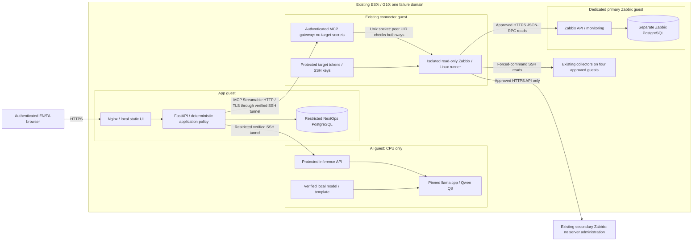
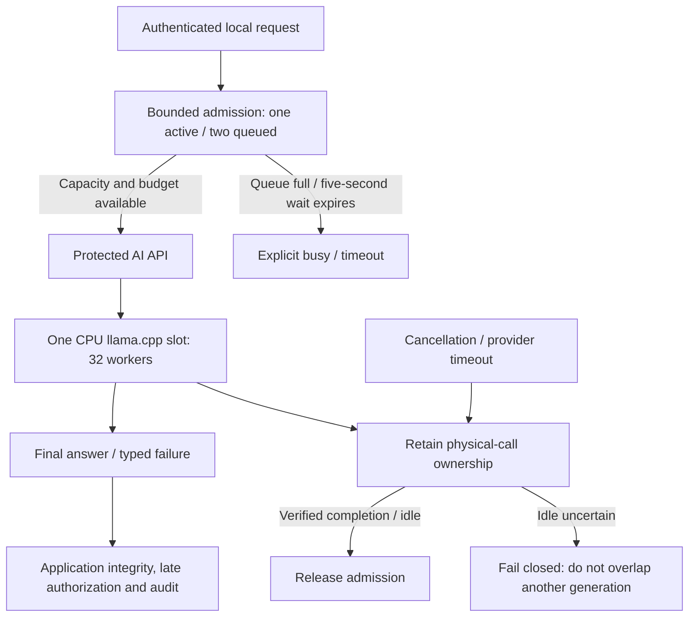
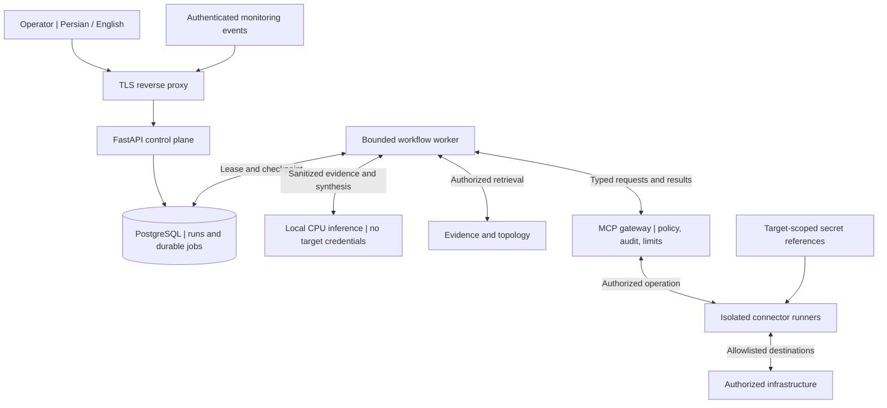
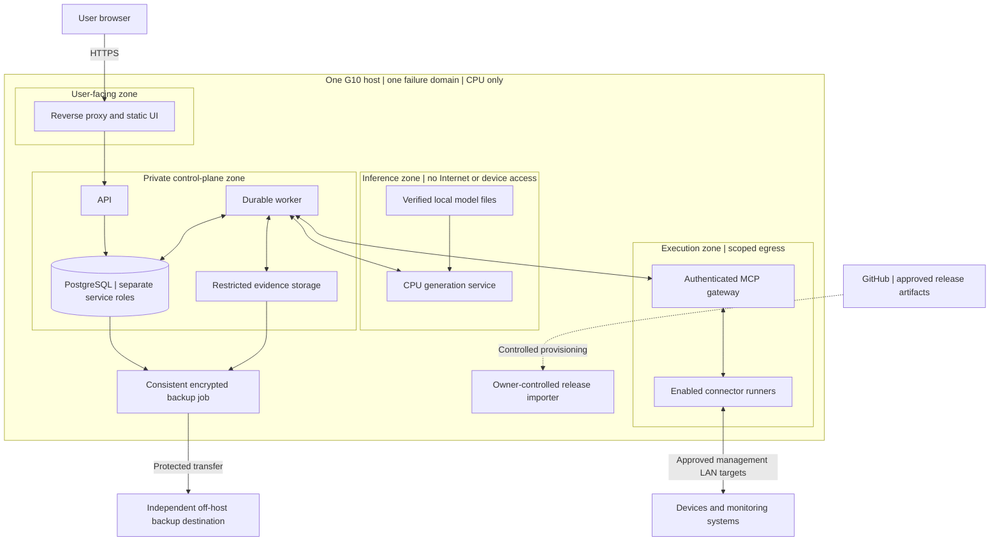
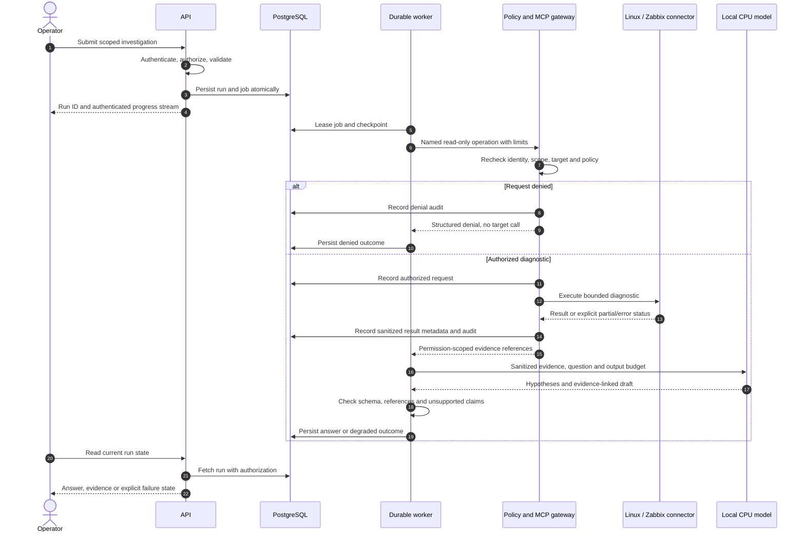
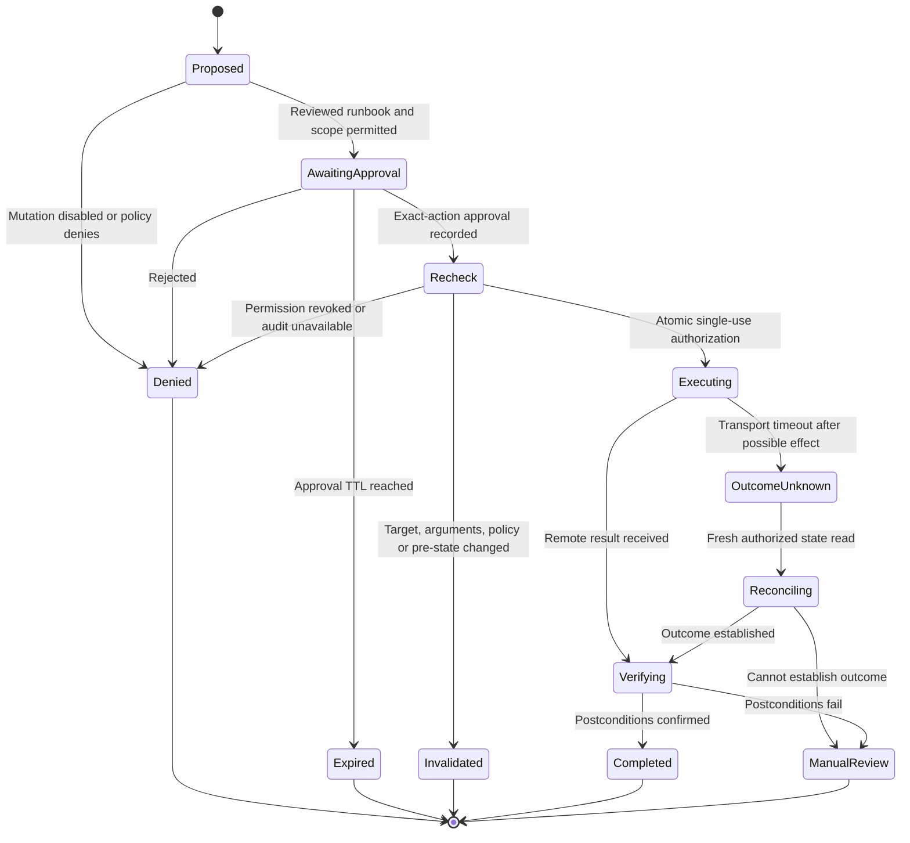
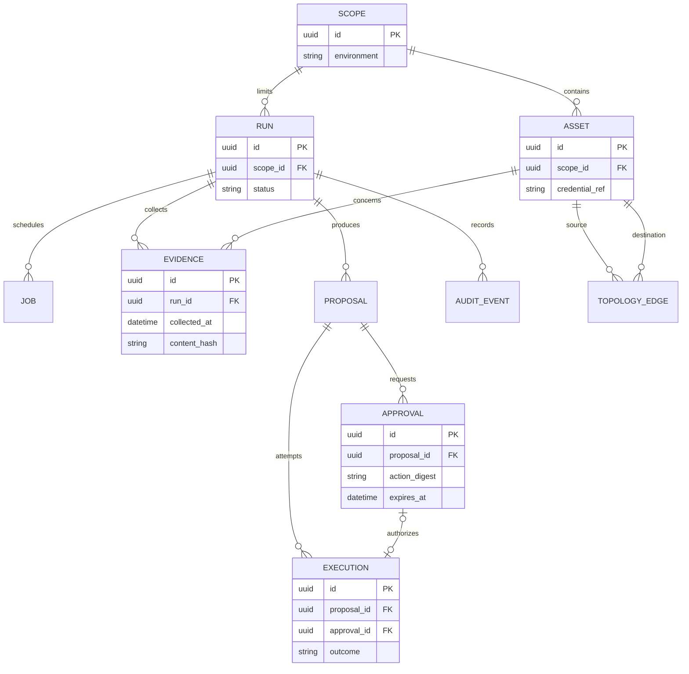
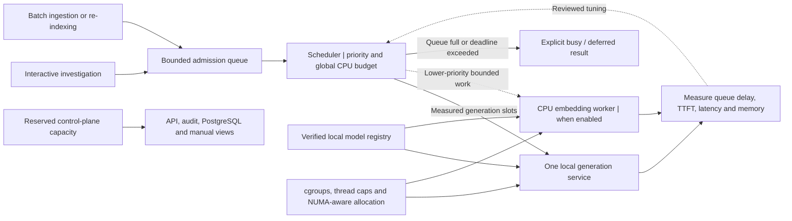

# Architecture diagram atlas

[فارسی](../fa/DIAGRAMS.md) · [Index](INDEX.md) · [Technology stack](TECH_STACK.md) · [Architecture](ARCHITECTURE.md)

## Current controlled system, 2026-10-07

These three views describe retained source `52e5179` and the existing four-role deployment.
They contain sanitized role names, not private inventory. The
[manifest](../status/current-release.yaml) and
[live qualification](../requirements/AUDIT_REPAIR_LIVE_QUALIFICATION_2026-10-07.md) own identities
and measured gates. Diagrams are descriptive, not authorization or new production acceptance.

### C1. Deployment and credential ownership



The gateway has loopback-only networking; only its separate runner reaches approved targets.
Application service credentials, target tokens and user sessions are different identities.
The disabled old HTTP service is not a fallback. GitHub/package registries have no runtime arrow.
No additional database, connector or GPU VM is implied.

### C2. Source-scoped investigation, evidence and audit

```mermaid
sequenceDiagram
    autonumber
    actor User as Authenticated user
    participant API as App API / policy
    participant DB as NextOps PostgreSQL
    participant Gate as MCP gateway
    participant Runner as Isolated runner
    participant Target as Approved Zabbix / Linux
    participant AI as Local CPU inference
    User->>API: Question + approved source/target
    API->>DB: Current session/scope checks + durable start
    API->>Gate: Named read + service identity + binding/correlation
    Gate->>Runner: Bounded operation over peer-verified Unix socket
    Runner->>Runner: Check registry, source binding, scope and limits
    Runner->>Target: Allowlisted read with runner-held target credential
    Target-->>Runner: Bounded observations or explicit dependency failure
    Runner-->>Gate: Typed source/time/scope envelope
    Gate-->>API: Validated envelope or typed denial/failure
    alt Valid evidence and generation available
        API->>API: Validate, redact, compute scoped counts/coverage
        API->>AI: Question + sanitized evidence + bounded budget
        AI-->>API: Successful final answer
        API->>API: Deterministic answer-integrity checks
        API->>DB: Recheck current access; atomically commit result/hash/audit
        alt Current access and mandatory audit commit succeed
            DB-->>API: Committed authorized result
            API-->>User: Answer + source/time/scope and limitations
        else Access revoked or required audit fails
            DB-->>API: Denial or dependency failure
            API-->>User: Explicit error; no result disclosure
        end
    else Missing/denied/failed dependency
        API->>DB: Mandatory bounded failure audit
        API-->>User: Explicit limitation/error; no invented healthy evidence
    end
```

Timeout/generation errors follow the failure/audit path, not successful result disclosure.
The request is bounded API orchestration, not a deployed general worker. The gateway's fsynced
service journal is supplemental; it does not bypass mandatory PostgreSQL user audit. General chat
uses its existing owner-scoped conversation endpoints without requiring a Zabbix read. Saved
history is not fresh infrastructure evidence or model training. Out-of-band privileged target
changes still require controlled quiescence.

### C3. Bounded inference and physical-call ownership



Configured context is 16K with six whole saved turns; thinking is off. Queue/provider/app/proxy
budgets remain 5/300/330/360 seconds. A successful health probe is not native-idle proof. Cancellation
is not proof of remote stop. Raw quality, thinking/privacy, full-window, current-source server-WAN,
VM cold start and sustained load remain unqualified; browser WAN blocking alone is not server
offline acceptance.

## Future target atlas: preserved design, not current deployment

The seven original views below retain target concepts from the master specification. Their
general worker, retrieval, topology, embeddings, off-host backup and remediation paths are not
deployed by this documentation update. Direct database arrows in these conceptual views do not
grant the current gateway database access. See C1–C3 for the actual path.

Each view answers a separate design question. Arrows describe labeled data/request/state flows,
not unrestricted network permission. Dashed provisioning links are not cloud runtime dependencies.
The active v3 master prompt and its immutable v2 archive remain unchanged by this update.

### 1. System context and trust boundaries

Who interacts with NextOps, and where may infrastructure credentials exist?



The worker requests evidence through the gateway; it does not connect directly to devices. The model receives only permitted, sanitized context. Policy is enforced again at the execution boundary. All eleven integration families fit behind the connector contract; not all run by default.

### 2. Single-host deployment and network zones

Where do the processes run, and what happens when the G10 fails?



Zones are intended restrictions, not implemented firewall rules. Compose networks alone are not a complete egress policy. Only the reverse proxy is user-facing; host administration has a separate approved path. Importing a release is not permission to run arbitrary GitHub workflows on the management host. Recovery keys need their own protected recovery process. The off-host backup destination is still unresolved; a second directory on the G10 is not disaster recovery.

### 3. First read-only investigation

How does the first useful workflow produce an evidence-linked answer?



Change approval is not needed for an authorized read, but access checks and audit still apply. Connector failures must remain visible; missing evidence is not replaced with invented measurements. Model unavailability leaves a readable run and its collected evidence, not a silently rerouted cloud request. Sequence arrows to PostgreSQL represent distinct scoped service roles, not a shared superuser.

### 4. Future remediation lifecycle

How is an exact action approved, and how are ambiguous remote outcomes handled?



**All mutation paths remain disabled in the MVP.** Approval binds the exact action, arguments, target, requester, environment, expected pre-state, policy version, expiry and single-use nonce. An uncertain outcome must never trigger a blind retry. Cancellation of local work does not prove remote cancellation. Rollback is a separately authorized operation, not an automatic transition in this diagram. This is the remediation sub-workflow, not the entire investigation state machine.

### 5. Core data relationships

What must be stored durably? This is a conceptual subset—not an implemented schema.



Execution approval is nullable for permitted reads; policy requires it for enabled mutations. A consumed approval cannot authorize another execution: enforce uniqueness and atomic transitions. Scope-safe foreign keys, role assignments, retention, audit-only administrative events, document chunks and many-to-many evidence links need the full design in [Data and API](DATA_API.md). `credential_ref` is a reference, never a plaintext credential. An asset relation is observed or inferred with provenance and freshness; it is not proof of a live network link.

### 6. CPU work admission and resource control

How can the API stay responsive while the model is busy?



The initial benchmark starts with one active generation request and increases concurrency only after measurement. The diagram is not a claim of a specific thread count, core count or tokens/second. Count prompt work, generation, embeddings, ingestion, compilation and database activity in one resource budget. Async APIs do not make CPU-heavy inference free. The old 90-CPU/1-TB estimate is historical; the hardware record supersedes it without establishing available serving capacity.

### 7. GitHub-to-server release path

How do reviewed artifacts reach the server without granting untrusted code infrastructure access?

```mermaid
flowchart LR
    C["Small source change"] --> PR["Reviewable branch / pull request"]
    PR --> CI["Isolated checks | no device credentials"]
    CI --> REV["Review and approved commit"]
    REV --> ART["Pinned build, checksums and dependency manifests"]
    ART --> LAB["Authorized staging and CPU validation"]
    LAB --> GATE["Owner release approval"]
    GATE --> PRE["Backup, migration and compatibility preflight"]
    PRE --> DEP["Controlled G10 deployment"]
    DEP --> HEALTH["Readiness and verification"]
    HEALTH -->|"Healthy"| ACCEPT["Accept release"]
    HEALTH -->|"Unhealthy"| REC["Tested rollback or recovery procedure"]
```



This is a future end-to-end promotion policy, not a claim of automated deployment. Isolated Actions CI is configured; it does not authorize server access. Generic pull requests never run on a privileged persistent G10 runner. Hardware/lab checks are explicitly authorized and isolated. Rollback must account for schema and model compatibility; restarting an older container does not undo a database migration. Offline releases follow the same verification gates through an imported bundle.

### Editing and rendering

Keep English and Persian views equivalent. Diagram identifiers and database fields stay in English; explanations and operator-facing labels are localized. Use ordinary Mermaid `flowchart`, `sequenceDiagram`, `stateDiagram-v2` and `erDiagram` blocks. GitHub supports Mermaid in Markdown; syntax support depends on its renderer version. See [GitHub's diagram guide](https://docs.github.com/en/get-started/writing-on-github/working-with-advanced-formatting/creating-diagrams), reviewed 2026-09-20.

No external image host, embedded credential, production address or diagram-generation service is required. GitHub rendering is a documentation feature, not part of NextOps's offline runtime. Text/link checks are not a Mermaid rendering test. The [earlier review record](../VISUAL_REVIEW.md) is historical, not proof that the new C1–C3 views were rendered.
