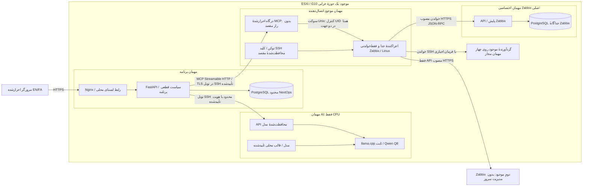
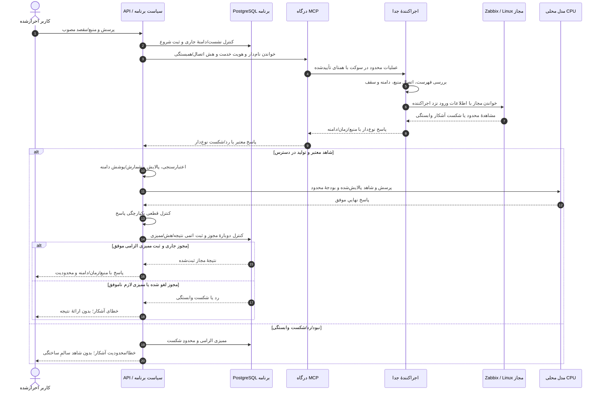
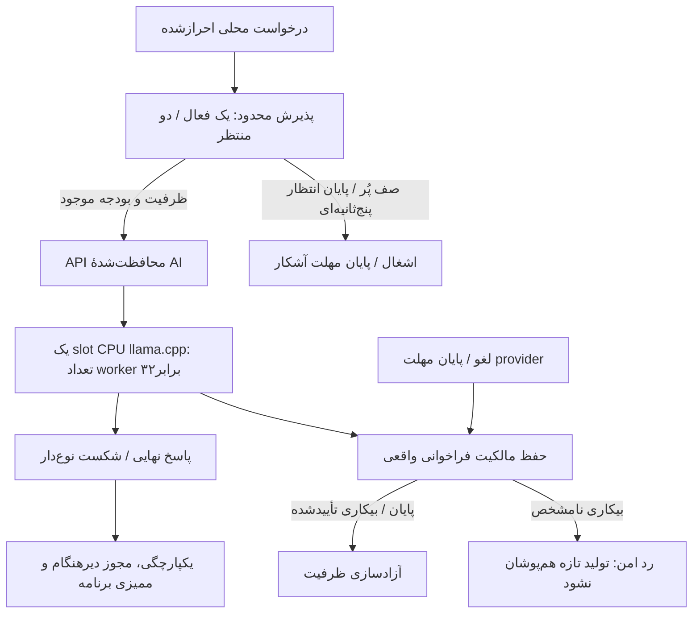
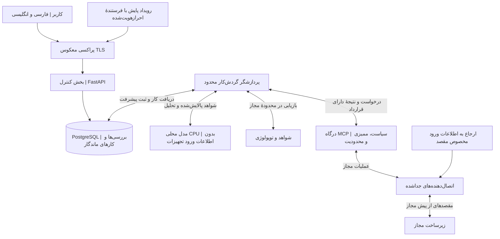
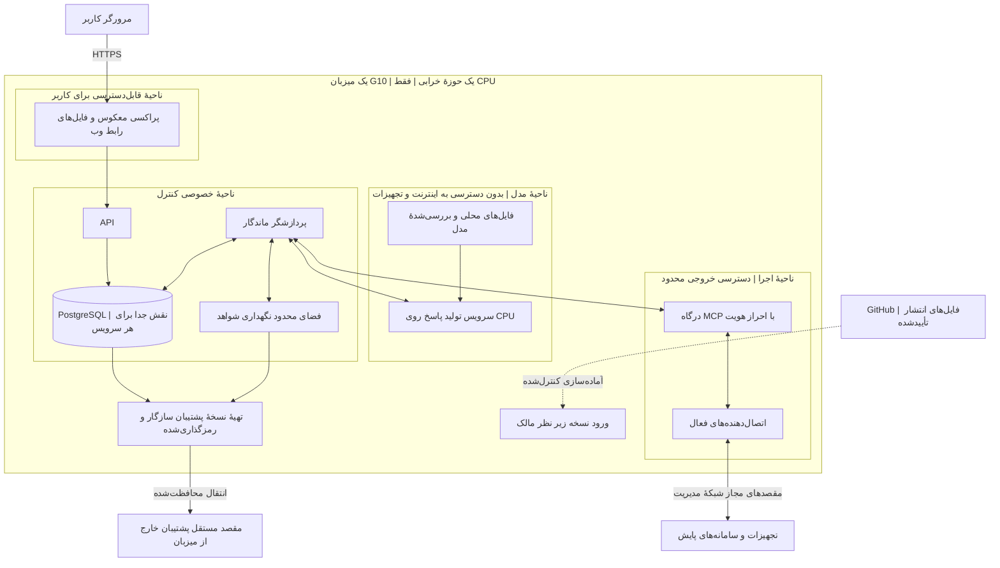
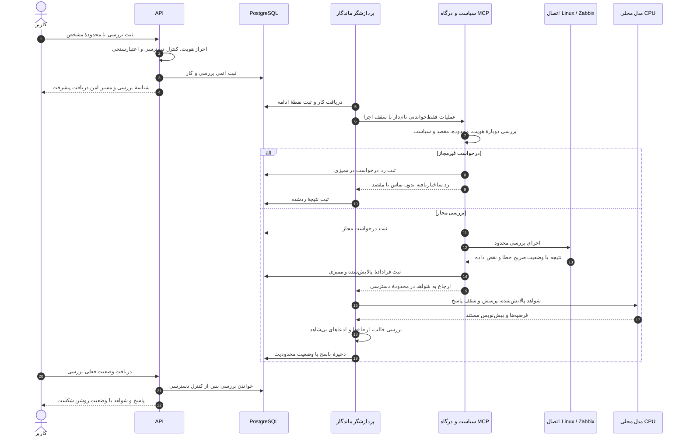
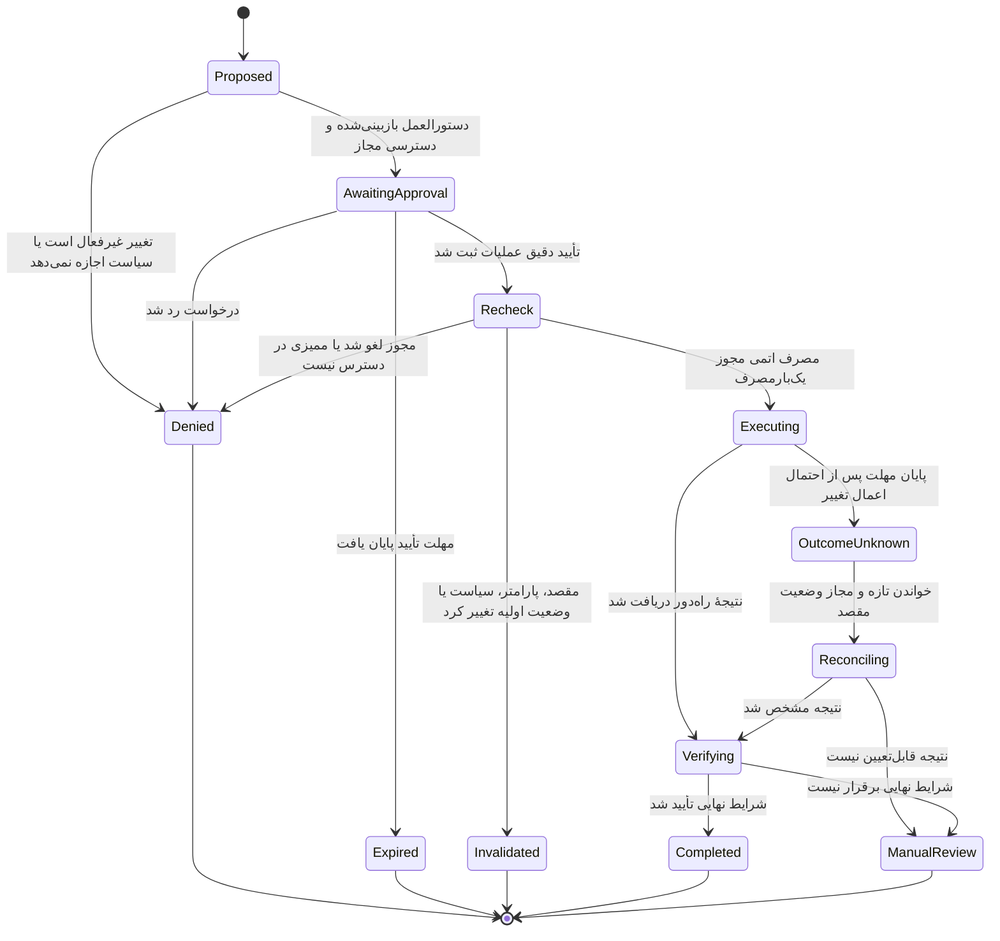
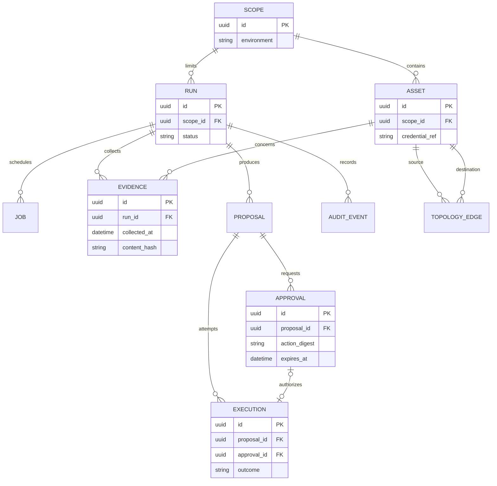
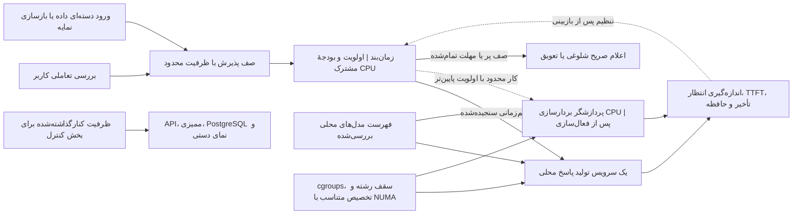
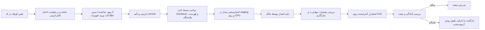

# مجموعهٔ نمودارهای معماری

[English](../en/DIAGRAMS.md) · [فهرست](INDEX.md) · [فناوری‌ها](TECH_STACK.md) · [معماری](ARCHITECTURE.md)

## سامانهٔ کنترل‌شدهٔ جاری، ۷ اکتبر ۲۰۲۶

سه نمای نخست، کد تثبیت‌شدهٔ `52e5179` و استقرار چهار نقش موجود را نشان می‌دهند. نام‌ها
نقش عمومی‌اند، نه موجودی خصوصی. [manifest](../status/current-release.yaml) و
[پذیرش زنده](../requirements/AUDIT_REPAIR_LIVE_QUALIFICATION_2026-10-07.md) مرجع شناسه و نتیجهٔ
سنجیده‌اند. نمودار توصیف است، نه مجوز یا پذیرش تازهٔ تولید.

### C1. استقرار و مالکیت اطلاعات ورود

شبکهٔ درگاه فقط loopback است؛ فقط اجراکنندهٔ جدا به مقصد مجاز می‌رسد. اطلاعات ورود خدمت
برنامه، توکن مقصد و نشست کاربر هویت‌های متفاوت‌اند. HTTP قدیمیِ غیرفعال، جایگزین نیست.
GitHub و مخزن بسته در مسیر اجرا نیستند؛ ماشین تازهٔ پایگاه، اتصال یا GPU از نمودار نتیجه
نمی‌شود.

### C2. بررسی محدود به منبع، شاهد و ممیزی

خطای تولید/پایان مهلت به مسیر شکست/ممیزی می‌رود، نه ارائهٔ موفق نتیجه.
این مسیر، هماهنگی محدود API است، نه worker عمومی مستقر. دفتر fsync خدمت درگاه مکمل است و
ممیزی الزامی کاربر در PostgreSQL را دور نمی‌زند. گفت‌وگوی عمومی از API مخصوص مالک استفاده
می‌کند و به خواندن Zabbix نیاز ندارد. سابقه، شاهد تازهٔ زیرساخت یا آموزش مدل نیست. تغییر
ممتاز مقصد بیرون از برنامه همچنان به توقف پذیرش کنترل‌شده نیاز دارد.

### C3. ظرفیت محدود مدل و مالکیت فراخوانی واقعی

زمینهٔ تنظیم‌شده16K، سابقه شش نوبت کامل و استدلال خاموش است. مهلت صف/provider/برنامه/
پراکسی، ۵/۳۰۰/۳۳۰/۳۶۰ ثانیه باقی است. پاسخ سلامت، اثبات بیکاری بومی نیست؛ لغو، اثبات توقف
راه‌دور نیست. کیفیت خام، استدلال/حریم خصوصی، کل زمینه، WAN سرورِ همین کد، شروع سرد VM و بار
پایدار پذیرفته نیستند؛ منع WAN مرورگر به‌تنهایی پذیرش آفلاین سرور نیست.

## مجموعهٔ آینده: طرح حفظ‌شده، نه استقرار جاری

هفت نمای اولیهٔ زیر، مفهوم مقصد از مشخصات اصلی را حفظ می‌کنند. worker عمومی، بازیابی،
توپولوژی، بردارسازی، پشتیبان خارج از میزبان و اصلاح زیرساخت با تغییر این سند مستقر نمی‌شوند.
پیکان مستقیم پایگاه در نماهای مفهومی، به درگاه جاری دسترسی پایگاه نمی‌دهد؛ مسیر واقعی
در C1 تا C3 آمده است.

هر نما پرسش طراحی جداگانه‌ای را پاسخ می‌دهد. پیکان، جریان برچسب‌دار داده/درخواست/وضعیت است،
نه مجوز آزاد شبکه؛ خط‌چینِ آماده‌سازی، وابستگی ابری اجرا نیست. متن فعال v3 و بایگانی
تغییرناپذیر v2 با این به‌روزرسانی تغییر نمی‌کنند.

### ۱. نمای کلی و مرزهای دسترسی

چه کسی با NextOps کار می‌کند و اطلاعات ورود به تجهیزات در اختیار کدام جزء قرار می‌گیرد؟

پردازشگر شواهد را از طریق درگاه می‌گیرد و مستقیماً به تجهیزات متصل نمی‌شود. مدل فقط متن مجاز و پالایش‌شده را دریافت می‌کند. کنترل سیاست در مرز اجرا دوباره انجام می‌شود. هر یازده خانوادهٔ اتصال از همین قرارداد استفاده می‌کنند؛ لازم نیست همه از ابتدا فعال باشند.

### ۲. استقرار روی یک میزبان و ناحیه‌های شبکه

فرایندها کجا اجرا می‌شوند و خرابی سرور G10 چه پیامدی دارد؟

این ناحیه‌ها محدودیت‌های موردنظر را نشان می‌دهند، نه قواعد فایروالِ پیاده‌سازی‌شده. شبکه‌های Compose به‌تنهایی سیاست کامل کنترل ترافیک خروجی نیستند. کاربر فقط به پراکسی معکوس دسترسی دارد و مدیریت میزبان مسیر مجاز جداگانه‌ای می‌خواهد. دریافت یک نسخه از GitHub به معنای اجازهٔ اجرای هر گردش‌کار روی سرور مدیریت نیست. کلیدهای بازیابی نیز به فرایند نگهداری و بازیابی مستقل نیاز دارند. مقصد پشتیبان خارج از میزبان هنوز تعیین نشده است؛ پوشه‌ای دیگر روی G10 جایگزین بازیابی پس از خرابی میزبان نیست.

### ۳. نخستین بررسی فقط‌خواندنی

درخواست کاربر چگونه به پاسخی با ارجاع به شواهد تبدیل می‌شود؟

خواندن مجاز، تأیید تغییر نمی‌خواهد؛ اما کنترل دسترسی و ممیزی حذف نمی‌شوند. شکست اتصال باید آشکار بماند و جای دادهٔ مفقود را اندازه‌گیری ساختگی نگیرد. اگر مدل در دسترس نباشد، بررسی و شواهد جمع‌آوری‌شده همچنان قابل‌مشاهده‌اند؛ درخواست پنهانی به سرویس ابری منتقل نمی‌شود. ارتباط اجزای مختلف با PostgreSQL با نقش‌های محدود و جدا انجام می‌شود، نه با حساب مدیر مشترک.

### ۴. چرخهٔ اقدامات اصلاحی در مراحل آینده

تأیید به کدام عملیات تعلق می‌گیرد و نتیجهٔ نامشخص اجرای راه‌دور چگونه پیگیری می‌شود؟

**تمام مسیرهای تغییردهنده در نسخهٔ اولیه غیرفعال می‌مانند.** تأیید به عمل دقیق، پارامترها، مقصد، درخواست‌کننده، محیط، وضعیت اولیهٔ موردانتظار، نسخهٔ سیاست، زمان انقضا و شناسهٔ یک‌بارمصرف متصل است. نتیجهٔ نامشخص هرگز نباید باعث تکرار کورکورانه شود. لغو کار محلی، توقف عملیات راه‌دور را ثابت نمی‌کند. بازگردانی تغییر یک عملیات جدا با مجوز مستقل است، نه گذار خودکار این نمودار. نمودار فقط زیرگردش‌کار اصلاح را نشان می‌دهد؛ شناسه‌های وضعیت برای هماهنگی با قرارداد فنی انگلیسی مانده‌اند.

### ۵. ارتباط داده‌های اصلی

چه اطلاعاتی باید ماندگار باشند؟ این نمای مفهومی بخشی از مدل است، نه طرح پایگاه دادهٔ پیاده‌سازی‌شده.

برای خواندن مجاز، ارجاع تأیید می‌تواند خالی باشد؛ سیاست برای تغییرات فعال‌شده آن را الزامی می‌کند. تأیید مصرف‌شده نباید اجرای دیگری را مجاز کند؛ یکتایی و گذار اتمی باید در پیاده‌سازی اعمال شوند. کلیدهای خارجیِ حافظ محدودهٔ دسترسی، نقش‌ها، نگهداری داده، ممیزی رخدادهای مدیریتیِ مستقل، قطعات اسناد و ارتباط چندبه‌چند شواهد در طرح کامل [داده و API](DATA_API.md) بررسی می‌شوند. فیلد `credential_ref` فقط ارجاع است، نه رمز عبور. ارتباط تجهیزات باید منبع، تازگی و برچسب مشاهده‌شده یا استنباط‌شده داشته باشد؛ وجود آن در پایگاه داده اتصال زنده را ثابت نمی‌کند. نام موجودیت‌ها و فیلدها عمداً انگلیسی است.

### ۶. پذیرش کار و کنترل منابع CPU

هنگام شلوغی مدل، API چگونه پاسخ‌گو می‌ماند؟

سنجش اولیه با یک درخواست فعال تولید پاسخ آغاز می‌شود و هم‌زمانی فقط پس از اندازه‌گیری افزایش می‌یابد. نمودار عددی برای رشته، هسته یا توکن‌برثانیه تضمین نمی‌کند. پردازش ورودی مدل، تولید پاسخ، بردارسازی، ورود داده، کامپایل و فعالیت پایگاه داده همگی از یک بودجهٔ منابع استفاده می‌کنند. ناهمگام بودن API هزینهٔ پردازش مدل را حذف نمی‌کند. برآورد قدیمیِ۹۰ واحد CPU/یک ترابایت، تاریخی است و رکورد سخت‌افزار جای آن را می‌گیرد؛ این رکورد هم ظرفیت آزاد خدمت را ثابت نمی‌کند.

### ۷. مسیر انتشار از GitHub تا سرور

چگونه نسخهٔ بازبینی‌شده به سرور می‌رسد، بدون اینکه کد غیرقابل‌اعتماد به زیرساخت دسترسی بگیرد؟

این مسیر سیاست ترفیع سرتاسری آینده است، نه ادعای استقرار خودکار. CI جداشدهٔ Actions تنظیم شده است، اما مجوز دسترسی سرور نمی‌دهد. درخواست‌های ادغام عادی روی runner دائمی و پرمجوز G10 اجرا نمی‌شوند. آزمون سخت‌افزار و تجهیزات آزمایشگاهی جدا و با مجوز روشن انجام می‌شود. بازگشت نسخه باید سازگاری پایگاه داده و مدل را در نظر بگیرد؛ اجرای کانتینر قدیمی، مهاجرت پایگاه داده را معکوس نمی‌کند. انتشار آفلاین نیز از همان معیارهای بررسی، با بستهٔ واردشده، عبور می‌کند.

### ویرایش و نمایش

معنای نمودارهای فارسی و انگلیسی یکسان بماند. شناسه‌ها و فیلدهای پایگاه داده انگلیسی‌اند و توضیح و برچسب کاربری ترجمه می‌شوند. از بلوک‌های استاندارد Mermaid با نوع‌های `flowchart`، `sequenceDiagram`، `stateDiagram-v2` و `erDiagram` استفاده کنید. GitHub نمودار Mermaid را در Markdown نمایش می‌دهد؛ پشتیبانی از نحو به نسخهٔ نمایشگر آن وابسته است. [راهنمای رسمی GitHub](https://docs.github.com/en/get-started/writing-on-github/working-with-advanced-formatting/creating-diagrams) در ۲۰ سپتامبر ۲۰۲۶ بررسی شده است.

این مستندات به میزبان تصویر خارجی، اطلاعات ورود، نشانی واقعی تجهیزات یا سرویس تولید نمودار نیاز ندارند. نمایش GitHub بخشی از مستندات است، نه وابستگی اجرای آفلاین. کنترل متن/پیوند جای آزمون نمایش Mermaid نیست. [گزارش بازبینی پیشین](../VISUAL_REVIEW.md) تاریخی است، نه اثبات ترسیم نماهای تازهٔ C1 تا C3.

